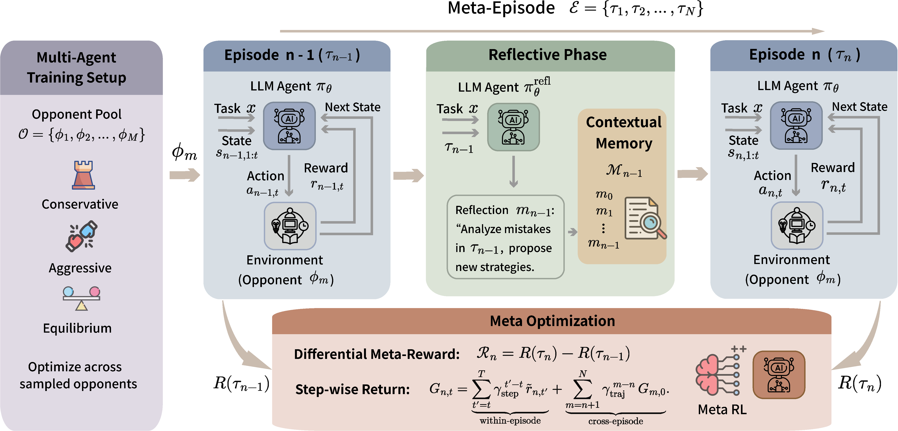

<div align="center">

# MAGE
**Meta-Reinforcement Learning for Language Agents toward Strategic Exploration and Exploitation**

<a href='https://arxiv.org/abs/2503.14189'></a>
</div>

## Brief Introduction

This repository contains the code of **MAGE**, a Meta-Reinforcement Learning method for language agents toward strategic exploration and exploitation.

<div align="left" style="padding: 0 0pt">

</div>
</br>

## Contents 

- [Training](#training)
- [Citation](#citation)

## Training
To train the LLM Agent with MAGE:
```
bash examples/kuhnpoker/mage.sh
```

See the `examples` folder for more examples. 


## Acknowledgements
This work is built upon [lamer](https://github.com/mlbio-epfl/LaMer), [verl](https://github.com/volcengine/verl), [verl-agent](https://github.com/langfengQ/verl-agent), [reflexion](https://github.com/noahshinn/reflexion), [RAGEN](https://github.com/mll-lab-nu/RAGEN). We thank the authors and contributors of these projects for sharing their valuable work.


## Citing
If you find our code useful, please consider citing:

```
```